# LabVIEW Computer Vision Course

Welcome to the LabVIEW Computer Vision Course repository! This repository contains all the resources and materials for the course, including slides, examples, and a final project.

Notes:  1) Powerpoint shows are preferred, because there are animations help for understanding.
        2) This course examples use LabVIEW Q3, but you can find LabVIEW 20.0 version in the second branch.

## Table of Contents

- [Session 1: Image and Geometeric Transformation](#Session-1-image-and-geometeric-transformation)
- [Session 2: Image Format](#Session-2-image-format)
- [Session 3: Image Threshold](#Session-3-image-threshold)
- [Session 4: Blurring Filters](#Session-4-blurring-filters)
- [Session 5: Morphological Operations](#Session-5-morphological-operations)
- [Session 6: Implementing Techniques](#Session-6-implementing-techniques)
- [Session 7: Real-time Camera](#Session-7-real-time-camera)
- [Final Project: Real-Time Object Tracking](#final-project-real-time-object-tracking)

## Session 1: Image and Geometeric Transformation
[Link to Session 1 Folder](./Session1)  
Description: This Session covers some geometeric transformations for images.  
*Slides:* [PDF](./Session1/Session1.pdf) | [PowerPoint](./Session1/Session1.pptx)  

 

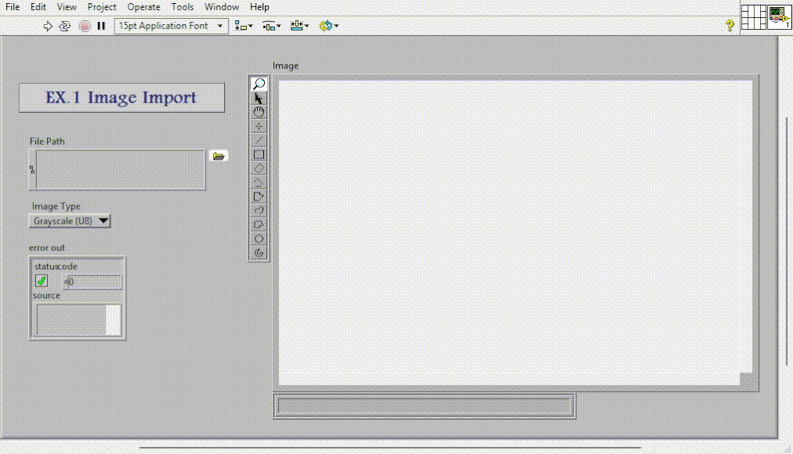

 

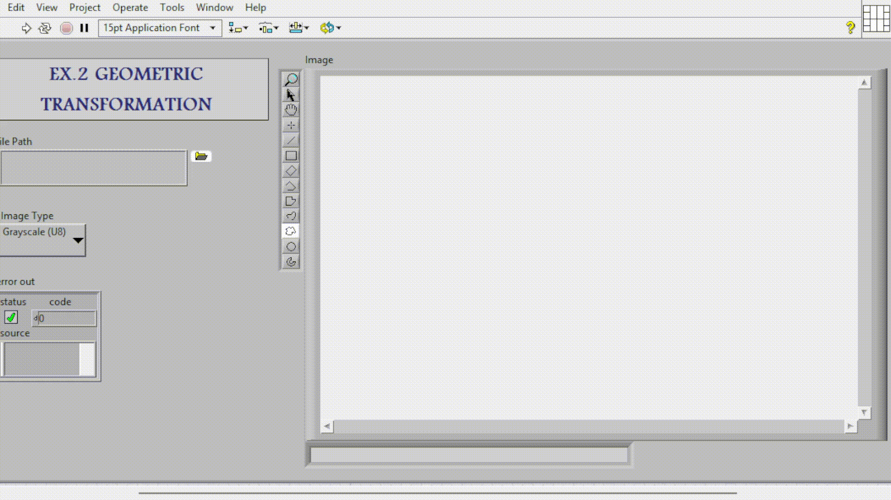

 

## Session 2: Image Format
[Link to Session 2 Folder](./Session2)  
Description: This Session dives into fundamental image formating.  
*Slides:* [PDF](Session2/Session2.pdf) | [PowerPoint](Session2/Session2.ppsx)
 

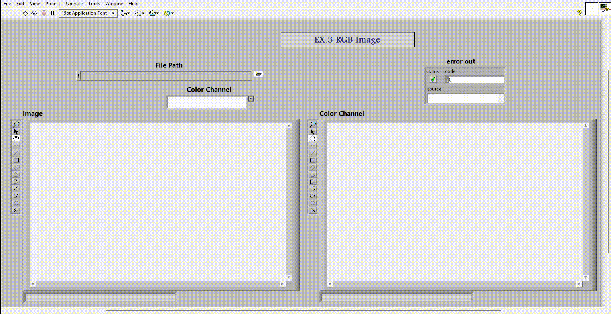

 

 

## Session 3: Image Threshold
[Link to Session 3 Folder](./Session3)  
Description: This session explain thresholding and color thresholding and their usage of object tracking.  
*Slides:* [PDF](./Session3/Session3.pdf) | [PowerPoint](./Session3/Session3.pptx)  
 

 

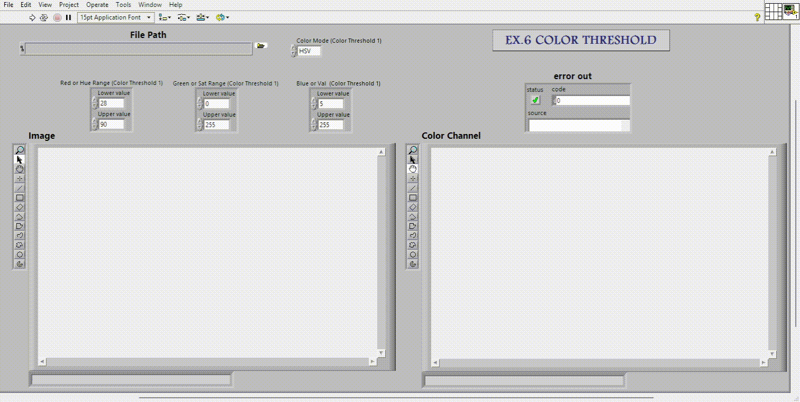

 

## Session 4: Blurring Filters
[Link to Session 4 Folder](./Session4)  
Description: This session explain blurrig filters in their role in noise reduction.  
*Slides:* [PDF](./Session4/Session4.pdf) | [PowerPoint](./Session4/Session4.pptx)  
 

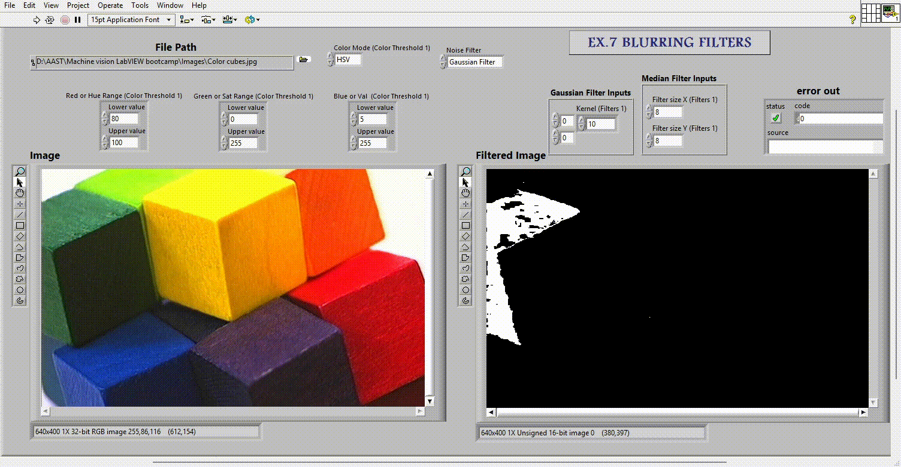

 

## Session 5: Morphological Operations
[Link to Session 5 Folder](./Session5)  
Description: This session explain Morphological Operations, specially dialtion and erosion ,and their role in enhance detected objects and denoise them.  
*Slides:* [PDF](./Session5/Session5.pdf) | [PowerPoint](./Session5/Session5.pptx)  
 

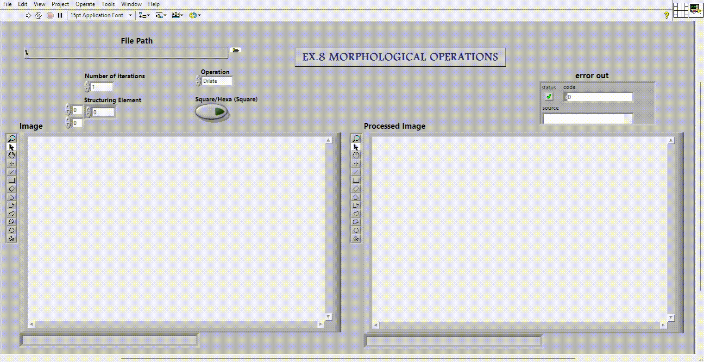

 

## Session 6: Implementing Techniques
[Link to Session 6 Folder](./Session6)  
Description: This session explain Fast Fourier Transform as implementation for blurring filters. Also its contains opening and closing operations as implementation for dilation and erosion.   
*Slides:* [PDF](./Session6/Session6.pdf) | [PowerPoint](./Session6/Session6.pptx)  
 

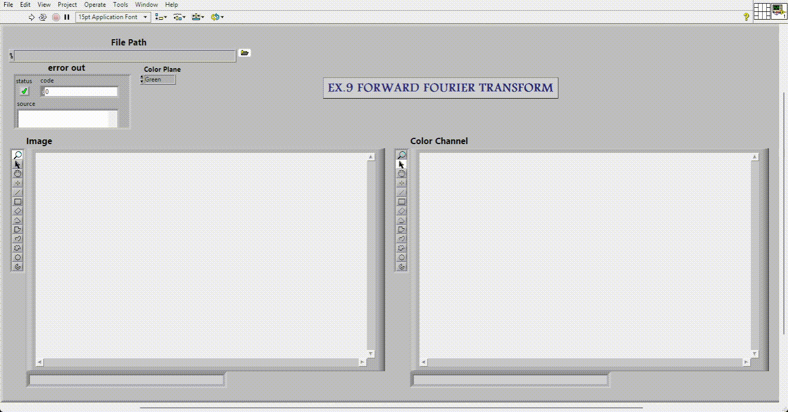

 

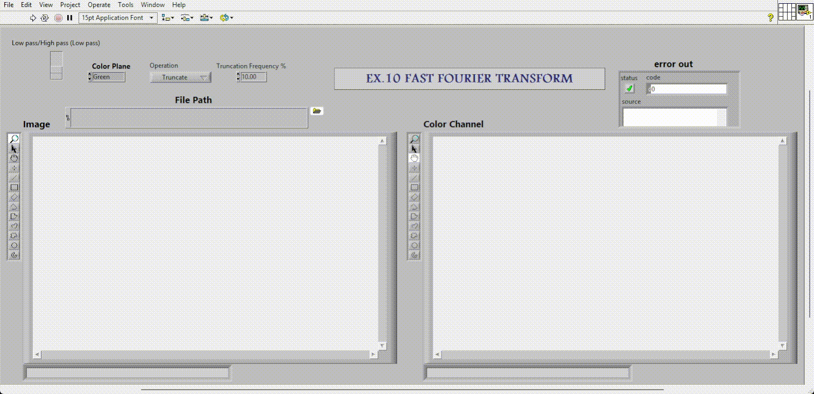

 

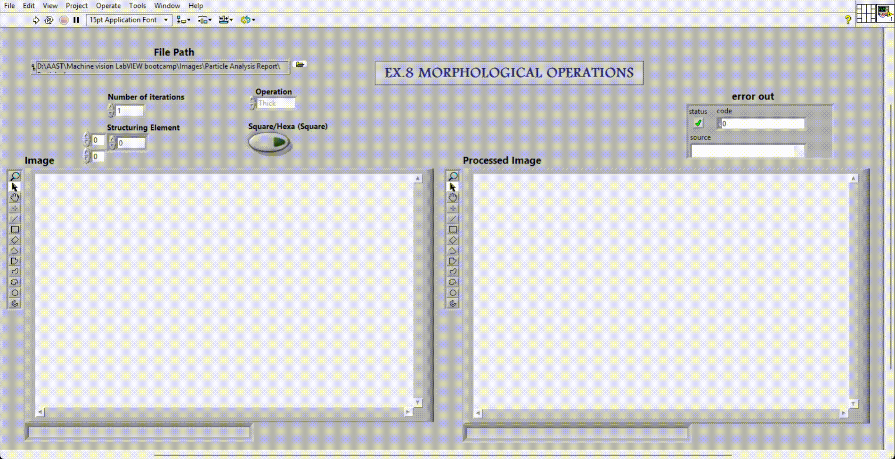

 

## Session 7: Real-time Camera
[Link to Session 7 Folder](./Session7)  
Description: This session focuses on debugging camera stream issues using a wired camera and provides a practical solution for integrating wireless IP cameras—such as the TP-Link Tapo C100—into LabVIEW. Since LabVIEW only supports direct image acquisition from wired cameras, we demonstrate how to use virtual camera tools to redirect wireless streams into LabVIEW, enabling real-time vision for robotics and autonomous systems.

NOTE: Download the presentation version, because it has explaination with videos whichh is necescary for understanding.  
*Slides:* [PDF](./Session7/Session7.pdf) | [PowerPoint](./Session7/Session7.rar)  
 

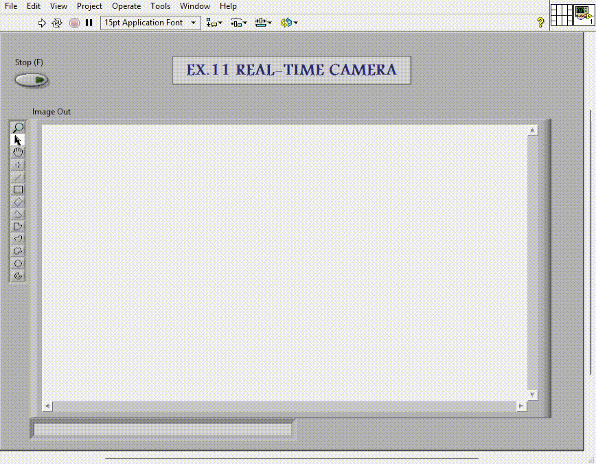

 

## Final Project: Real-Time Object Tracking
[Link to Final Project Folder](./FinalProject)  
Description: Apply everything you have learned in a real-time object tracking project and enhanced version for better approach.  
*Slides:* [PDF](./FinalProject/Session8.pdf) | [PowerPoint](./FinalProject/Session8.pptx)  

 

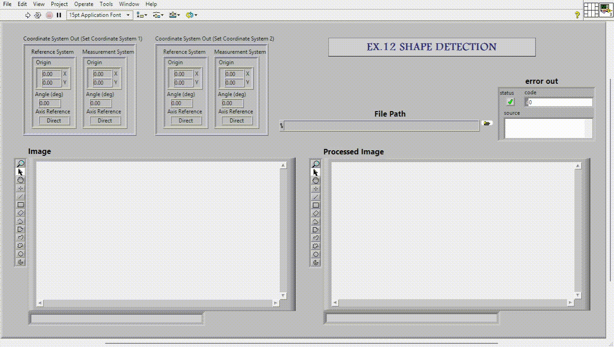

 

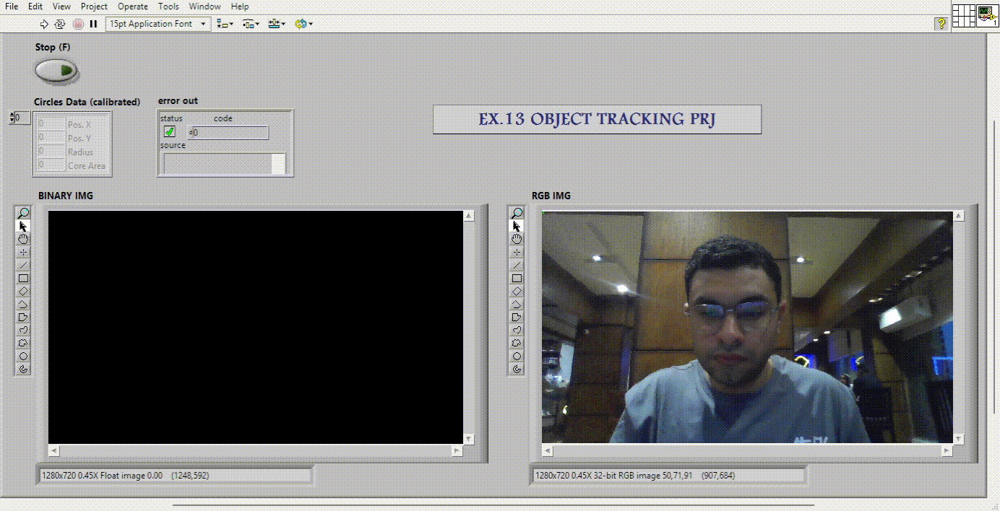

 

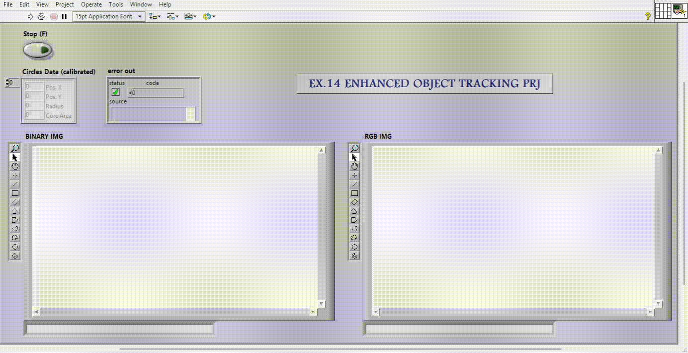

 